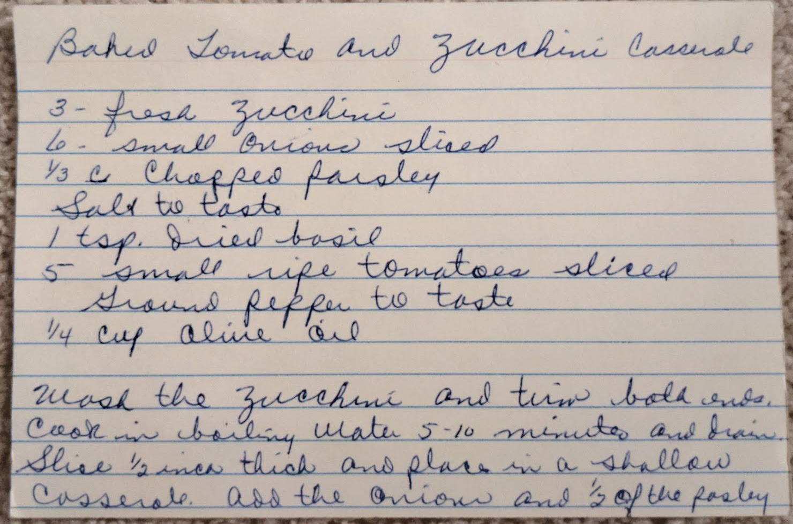
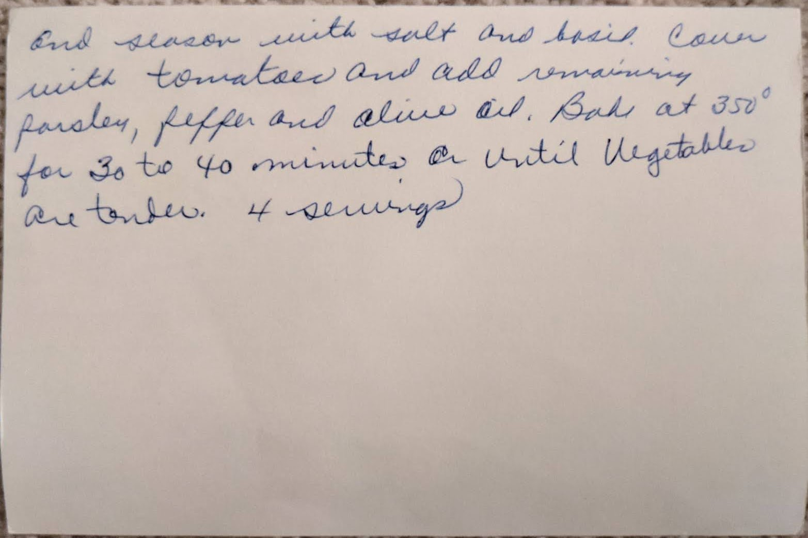

# {{ $frontmatter.title }}

### ingredients:

- <MixologyConversion n="3"/> fresh zucchini
- <MixologyConversion n="6"/> small onions sliced
- <MixologyConversion n="0.33 cup"/> chopped parsley
- <MixologyConversion n="1 tsp"/> dried basil
- <MixologyConversion n="5"/> small ripe tomatoes sliced
- <MixologyConversion n="0.25 cup"/> olive oil
- salt to taste
- ground pepper to taste

### instructions:

- wash the zucchini and trim both ends
- cook in boiling water 5-10 minutes and drain
- slice $\frac{1}{2}$ inch thick and place in a shallow casserole
- add the onion and $\frac{1}{2}$ of the parsley and season with salt and basil
- cover with tomatoes and add remaining parsley, pepper and olive oil
- bake at 350º for 30 to 40 minutes or until vegetables are tender
- 4 servings

---

**citation**:
[Aunt Euniav](../README.md)

