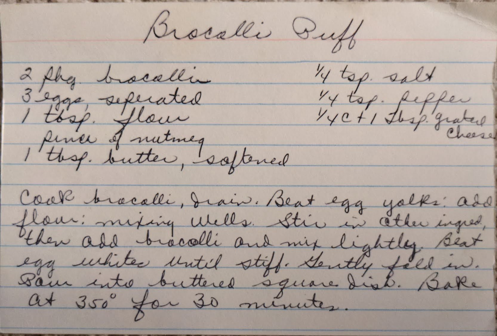

# {{ $frontmatter.title }}

### ingredients:

- <MixologyConversion n="2 pkg"/> broccoli
- <MixologyConversion n="3"/> eggs; separate
- <MixologyConversion n="1 tbsp"/> flour
- <MixologyConversion n="1 tbsp"/> butter, softened
- <MixologyConversion n="0.25 tsp"/> salt
- <MixologyConversion n="0.25 tsp"/> pepper
- <MixologyConversion n="0.25 cup"/> + <MixologyConversion n="1 tbsp"/> grated cheese [?]
- pinch of nutmeg

### instructions:

- cook brocolli, drain
- beat egg yolks
- add flour
- mixing well
- stir in other ingredients
- then add brocolli and mix lightly
- beat egg whites until stiff
- gently fold in
- pour into buttered square dish
- bake at 350º for 30 minutes

---

**citation**:
[Aunt Euniav](../README.md)

