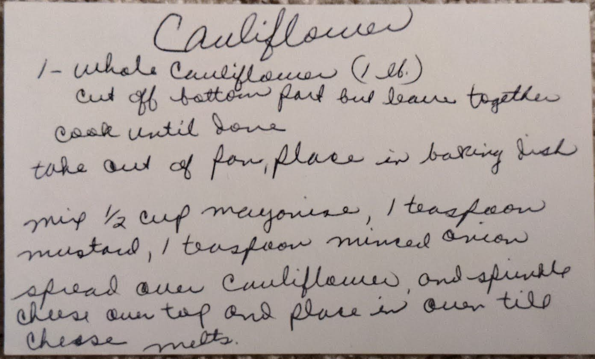

# {{ $frontmatter.title }}

### ingredients:

- <MixologyConversion n="1 whole"/> cauliflower (1 lbs)
- <MixologyConversion n="0.5 cup"/> mayonnaise
- <MixologyConversion n="1 tsp"/> mustard
- <MixologyConversion n="1 tsp"/> minced onion
- <MixologyConversion n="0.5 cup"/> cheese [?]

### instructions:

- cut off bottom part but leave together
- cook until done
- take out of pot, place in baking dish
- mix $\frac{1}{2}$ cup mayonnaise, 1 tsp mustard, 1 tsp minced onion
- spread over cauliflower and sprinkle cheese over top and place in oven till cheese melts

---

**citation**:
[Aunt Euniav](../README.md)

