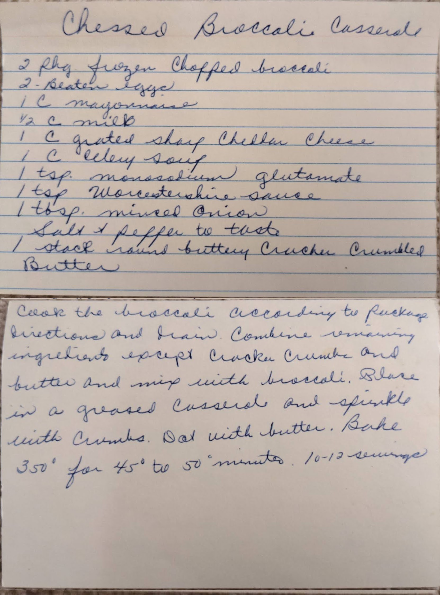

# {{ $frontmatter.title }}

### ingredients:

- <MixologyConversion n="2 pkg"/> frozen chopped broccoli
- <MixologyConversion n="2"/> eggs beaten
- <MixologyConversion n="1 cup"/> mayonnaise
- <MixologyConversion n="0.5 cup"/> milk
- <MixologyConversion n="1 cup"/> grated sharp cheddar cheese
- <MixologyConversion n="1 cup"/> celery soup
- <MixologyConversion n="1 tsp"/> monosodium glutamate
- <MixologyConversion n="1 tsp"/> worcestershire sauce
- <MixologyConversion n="1 tbsp"/> minced onion
- <MixologyConversion n="1 stack"/> round buttery cracker crumbled butter
- salt and pepper to taste

### instructions:

- cook the broccoli according to package directions and drain
- combine remaining ingredients except cracker crumble and butter and mix with broccoli
- place in a grated casserole and sprinkle with crumbs
- coat with butter
- bake 350º for 45 to 50 minutes
- 10-12 servings

---

**citation**:
[Aunt Euniav](../README.md)

