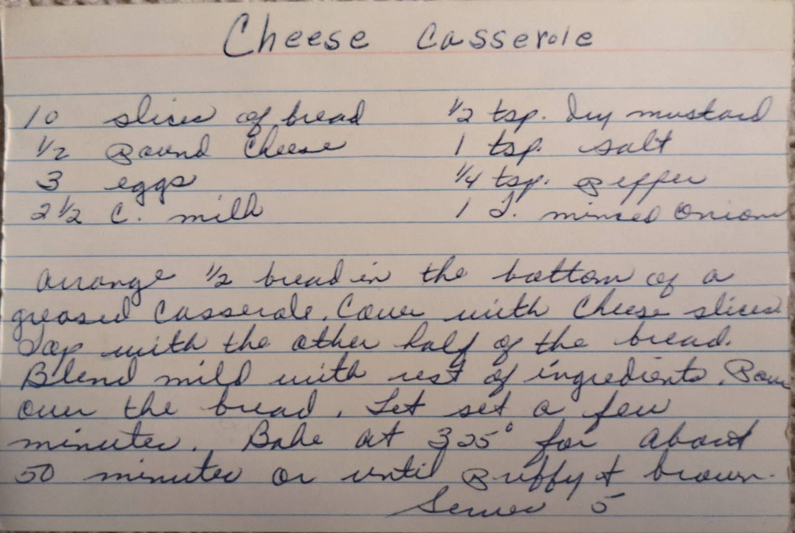

# {{ $frontmatter.title }}

### ingredients:

- <MixologyConversion n="10 slices"/> of bread
- <MixologyConversion n="0.5 lbs"/> cheese
- <MixologyConversion n="3"/> eggs
- <MixologyConversion n="2.5 cups"/> milk
- <MixologyConversion n="0.5 tsp"/> dry mustard
- <MixologyConversion n="1 tsp"/> salt
- <MixologyConversion n="0.25 tsp"/> pepper
- <MixologyConversion n="1"/> minced onion

### instructions:

- arrange $\frac{1}{2}$ bread in the bottom of a greased casserole
- cover with chese slices
- top with the other half of the bread
- blend milk with rest of ingredients
- pour over the bread
- let set a few minutes
- bake at 325º for about 50 minutes or until puffy and brown
- serves 5

---

**citation**:
[Aunt Euniav](../README.md)

