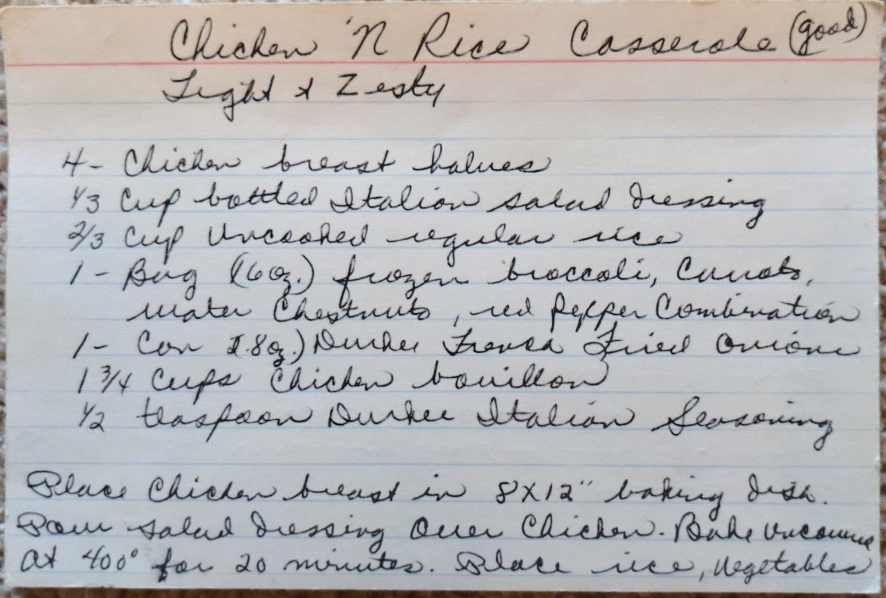
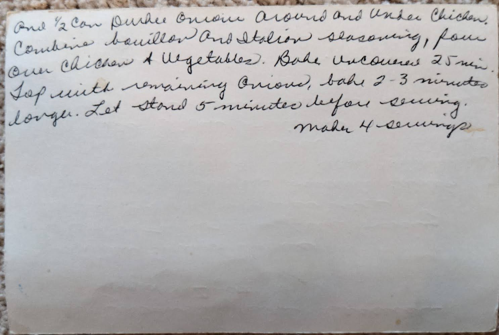
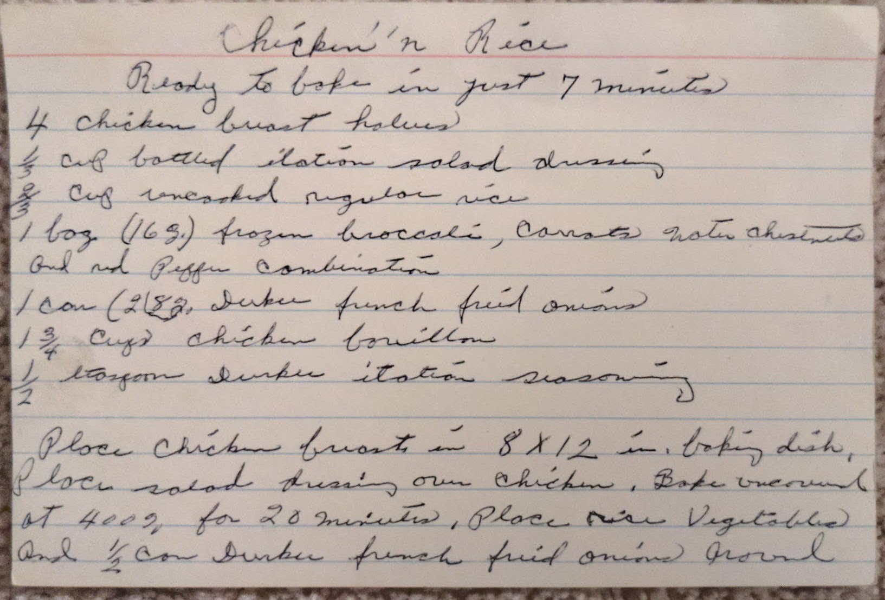
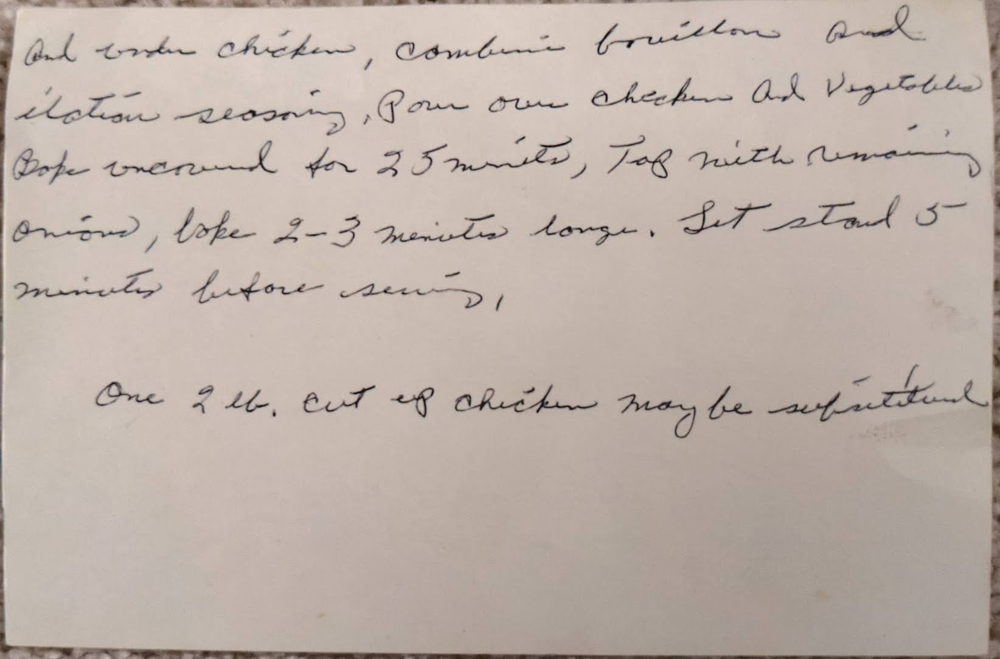

# {{ $frontmatter.title }}

light and zesty

ready to bake in just 7 minutes

### ingredients:

- <MixologyConversion n="4"/> chicken breast halves
- <MixologyConversion n="0.33 cups"/> bottled italian salad dressing
- <MixologyConversion n="0.66 cups"/> uncooked regular rice
- <MixologyConversion n="1 bag"/> (160oz) frozen broccoli, carrots, water chestnuts, red pepper combination
- <MixologyConversion n="1 can"/> (8oz) durkee's french fried onion
- <MixologyConversion n="1.75 cups"/> chicken bouillon
- <MixologyConversion n="0.5 tsp"/> durkee italian seasoning 

### instructions:

- place chicken breast in ${8x12}$ baking dish
- pour salad dressing over chicken
- bake uncovered at 400º for 20 minutes
- place rice, vegetables and $\frac{1}{2}$ can durkee onions around and under chicken
- combine bouillon and italian seasoning
- pour over chicken and vegetables
- bake uncovered [?] 25 minutes
- top with remaining onions
- bake 2-3 minutes longer
- let stand 5 minutes before serving
- makes 4 servings

---

**citation**:
[Aunt Euniav](../README.md)

potential duplicate

