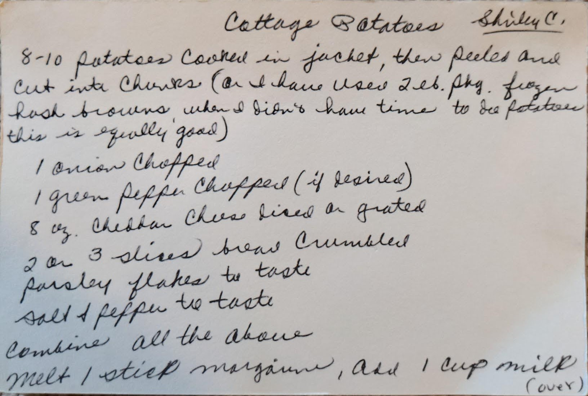
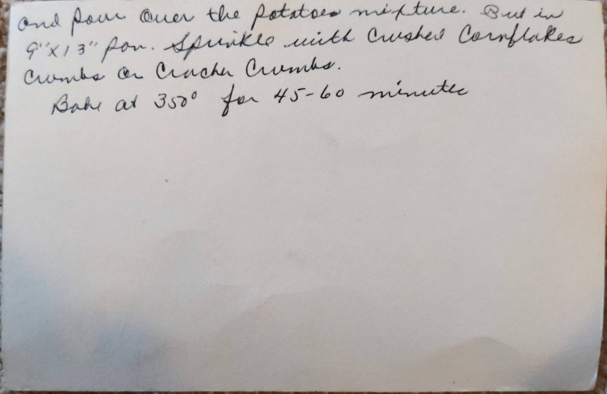
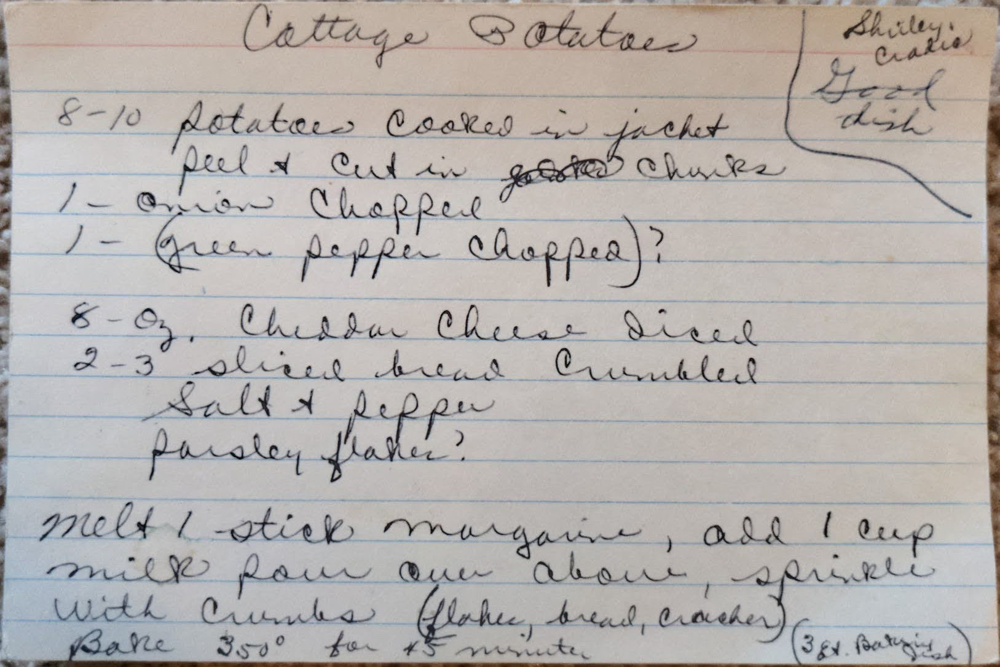

# {{ $frontmatter.title }}

> ### NOTES
> MARKED AS **NEEDS ASSISTANCE**

### ingredients:

- <MixologyConversion n="8-10"/> potatoes
- <MixologyConversion n="1"/> onion chopped
- <MixologyConversion n="1"/> green pepper chopped (if desired)
- <MixologyConversion n="8 oz"/> cheddar cheese sliced [?] and grated
- <MixologyConversion n="2-3 slices"/> bread crumbled [?]
- <MixologyConversion n="1 cup"/> milk
- <MixologyConversion n="1 stick"/> margarine
- parsley flakes to taste
- salt and pepper to taste

### instructions:

- 8-10 potatoes cooked in jacket, then peeled and cut into chunks ([?] and have used 2lbs package frozen hash browns,
when you didn't have time to [?] potatoes this is equally good)
- combine all the above
- melt 1 stick margarine
- add 1 cup milk and pour over potato mixture
- pour in ${9x13}$ pan
- sprinkle with crushed cornflakes
- combine [?] on crunch [?] [?]
- bake at 350º for 45-60 minutes

---

**citation**:
Shirley C (unknown)

potential duplicate

