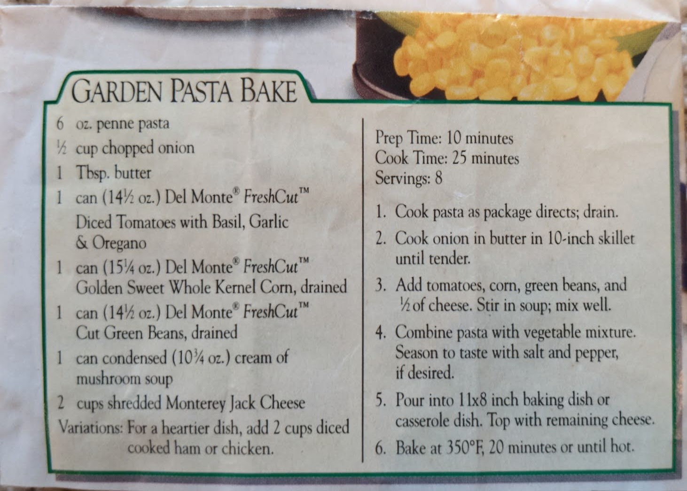

# {{ $frontmatter.title }}

prep time: 10 minutes
cook time: 25 minutes
servings: 8

### ingredients:

- <MixologyConversion n="6 oz"/> penne pasta
- <MixologyConversion n="0.5 cup"/> chopped onion
- <MixologyConversion n="1 tbsp"/> butter
- <MixologyConversion n="1 can"/> (14.5 oz) del monte freshcut diced tomatoes with basil, garlic & oregano
- <MixologyConversion n="1 can"/> (15.25 oz) del monte freshcut golden sweet whole kernel corn, drained
- <MixologyConversion n="1 can"/> (14.5 oz) del monte freshcut cut green beans, drained
- <MixologyConversion n="1 can"/> condensed (10.75 oz) cream of mushroom soup
- <MixologyConversion n="2 can"/> shredded monterey jack cheese
- (variation) for a heartier dish, add <MixologyConversion n="2 cups"/> diced cooked ham or chicken

### instructions:

- cook pasta as package directs; drain
- cook onion in butter in 10-inch skillet until tender
- add tomatoes, corn, green beans, and $\frac{1}{2}$ of cheese
- stir in soup; mix well
- combine pasta with vegetable mixture
- season to taste with salt and pepper, if desired
- pour into ${11x8}$ inch baking dish or casserole dish
- top with remaining cheese
- bake at 350ºF, 20 minutes or until hot

---

**citation**:
[Aunt Euniav](../README.md)

