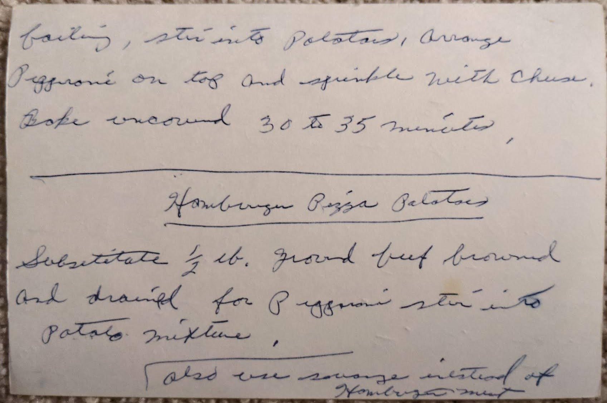

# {{ $frontmatter.title }}

> ### NOTES
> MARKED AS **NEEDS ASSISTANCE**

you can add [?] hamburger or sausage or just make it plain

### ingredients:

- <MixologyConversion n="1 pkg"/> scalloped potatoes
- <MixologyConversion n="1 can"/> (16 oz) tomatoes
- <MixologyConversion n="1.5 cup"/> water
- <MixologyConversion n="0.25 tsp"/> oregano [?] (or ground)
- <MixologyConversion n="1 pkg"/> (4 oz) sliced pepperoni
- <MixologyConversion n="1 pkg"/> (4 oz) shredded mozzarella cheese

### instructions:

- preheat [?] oven to 400º
- [?] potato slices and pocket [?] of [?] [?] mix into [?] [?] [?] casserole
- heat tomatoes, water and oregano to boiling
- stir into potatoes
- arrange pepperoni on top and sprinkle with cheese
- bake uncovered 30 to 35 minutes

---

**hamburger pizza potato**

- substitute $\frac{1}{2}$ lbs [?] ground beef [?] and [?] for pepperoni
- stir into potato mixture

**sausage pizza potato**

- substitute $\frac{1}{2}$ lbs pork sausage, browned [?] and drained for pepperoni
- stir into potato mixture

---

**citation**:
[Aunt Euniav](../README.md)

potential duplicate

