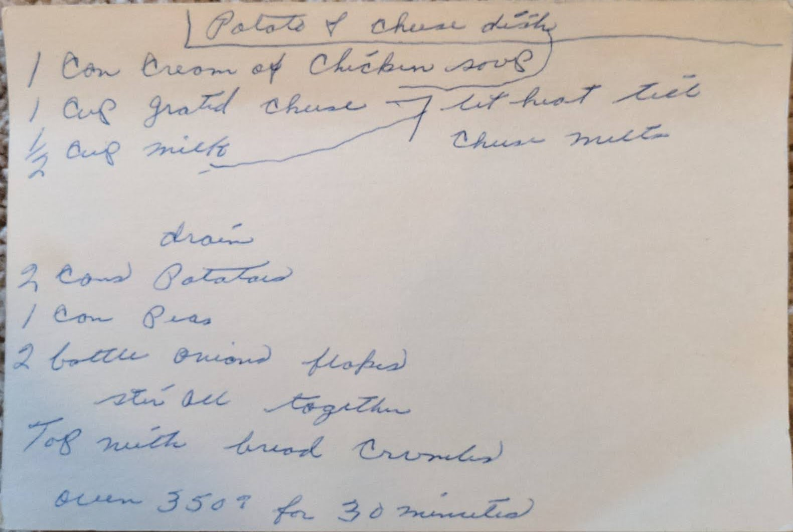

# {{ $frontmatter.title }}

> ### NOTES
> MARKED AS **NEEDS ASSISTANCE**

### ingredients:

- <MixologyConversion n="1 can"/> cream of chicken soup
- <MixologyConversion n="1 cup"/> greated cheese
- <MixologyConversion n="0.5 cup"/> milk [?]
- <MixologyConversion n="2 cans"/> potatoes
- <MixologyConversion n="1 can"/> peas
- <MixologyConversion n="2 bottle"/> [?] onion flakes

### instructions:

- drain
- stir all together
- top with [?] crumbles [?]
- oven 350º for 30 minutes

---

**citation**:
[Aunt Euniav](../README.md)

