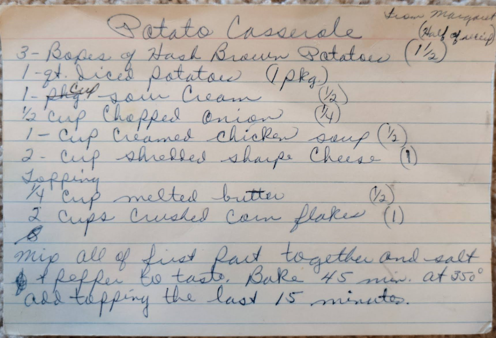

# {{ $frontmatter.title }}

### ingredients:

- <MixologyConversion n="3"/> Bopes [?] of hash brown potatoes
- <MixologyConversion n="1 qt"/> qt [? quart] diced potatoes
- <MixologyConversion n="1 cup"/> sour cream
- <MixologyConversion n="0.5 cup"/> chopped onion
- <MixologyConversion n="1 cup"/> cream chicken soup
- <MixologyConversion n="2 cups"/> shredded sharp cheese

Topping
- <MixologyConversion n="0.25 cup"/> melted butter
- <MixologyConversion n="2 cups"/> crushed corn flakes

### instructions:

- mix all of first part together and salt and pepper to taste
- bake 45 minutes at 350º
- add topping the last 15 minutes

---

**citation**:
Margaret (unknown)

