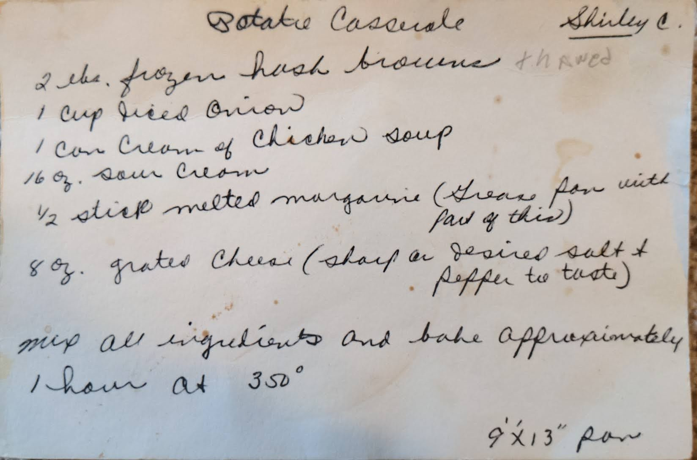

# {{ $frontmatter.title }}

### ingredients:

- <MixologyConversion n="2 lbs"/> [?] frozen hash browns (thawed)
- <MixologyConversion n="1 cup"/> fried onion
- <MixologyConversion n="1 can"/> cream of chicken soup
- <MixologyConversion n="16 oz"/> sour cream
- <MixologyConversion n="0.5 stick"/> melted margarine (grease pan with part of this)
- <MixologyConversion n="8 oz"/> grated cheese (sharp)
- desired salt and pepper to taste

### instructions:

- mix all ingredients and bake approximately 1 hour at 350º
- use ${9x13}$ pan

---

**citation**:
Shirley C (unknown)

