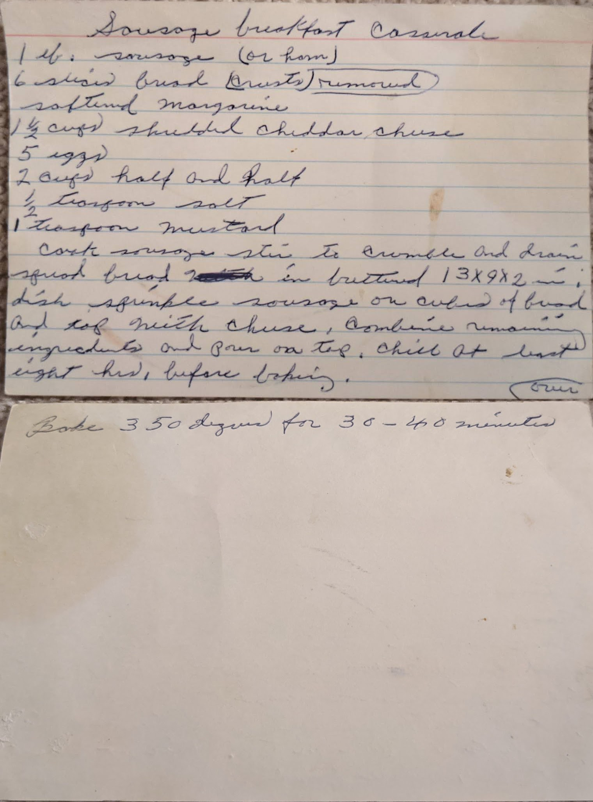

# {{ $frontmatter.title }}

> ### NOTES
> MARKED AS **NEEDS ASSISTANCE**

### ingredients:

- <MixologyConversion n="1 lbs"/> [?] sausage (or ham)
- <MixologyConversion n="6"/> [?] [?] [?] salted margarine [?]
- <MixologyConversion n="1.5 cups"/> [?] cheddar cheese
- <MixologyConversion n="5"/> eggs
- <MixologyConversion n="2 cups"/> half and half
- <MixologyConversion n="0.5 tsp"/> salt
- <MixologyConversion n="1 tsp"/> mustard

### instructions:

- cook sausage [?] to crumble and drain
- ...[?]...
- bake 350º for 30-40 minutes

---

**citation**:
[Aunt Euniav](../README.md)

