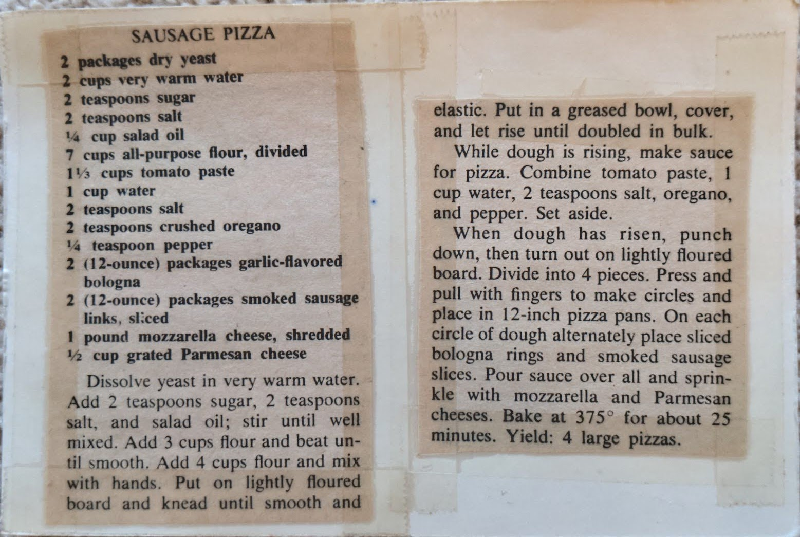

# {{ $frontmatter.title }}

### ingredients:

- <MixologyConversion n="2 packages"/> dry yeast
- <MixologyConversion n="2 cups"/> very warm water
- <MixologyConversion n="2 tsp"/> sugar
- <MixologyConversion n="2 tsp"/> salt
- <MixologyConversion n="0.25 cup"/> salad oil
- <MixologyConversion n="7 cups"/> all-purpose flour, divided
- <MixologyConversion n="1.33 cups"/> tomato paste
- <MixologyConversion n="1 cups"/> water
- <MixologyConversion n="2 tsp"/> salt
- <MixologyConversion n="2 tsp"/> crushed oregano
- <MixologyConversion n="0.25 tsp"/> pepper
- <MixologyConversion n="2 packages"/> (12 oz) garlic-flavored bologna
- <MixologyConversion n="2 packages"/> (12 oz) smoked sausage links, sliced
- <MixologyConversion n="2 lbs"/> mozzarella cheese, shredded
- <MixologyConversion n="0.5 cup"/> grated parmesan cheese

### instructions:

- dissolve yeast in very warm water
- add 2 teaspoons sugar, 2 teaspoons salt, and salad oil; stir until well mixed
- add 3 cups flour and beat until smooth
- add 4 cups flour and mix with hands
- put on lightly floured board and knead until smooth and elastic
- put in a greased bowl, cover, and let rise until doubled in bulk
- while dough is rising, make sauce for pizza
- combine tomato paste, 1 cup water, 2 teaspoons salt, oregano, and pepper; set aside
- when dough has risen, punch down, then turn out on lightly floured board
- divide into 4 pieces
- press and pull with fingers to make circles and place in 12-inch pizza pans
- on each circle of dough alternately place sliced bologna rings and smoked sausage slices
- pour sauce over all and sprinkle with mozzarella and parmesan cheeses
- bake at 375º for about 25 minutes
- yield: 4 large pizzas
 
---

**citation**:
Unknown magazine clipping

