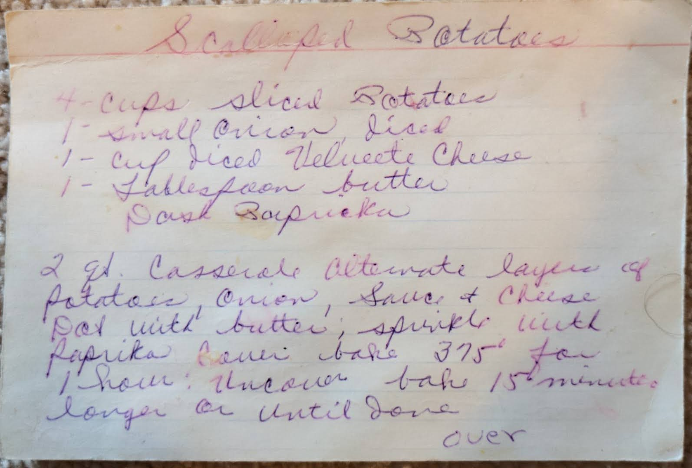
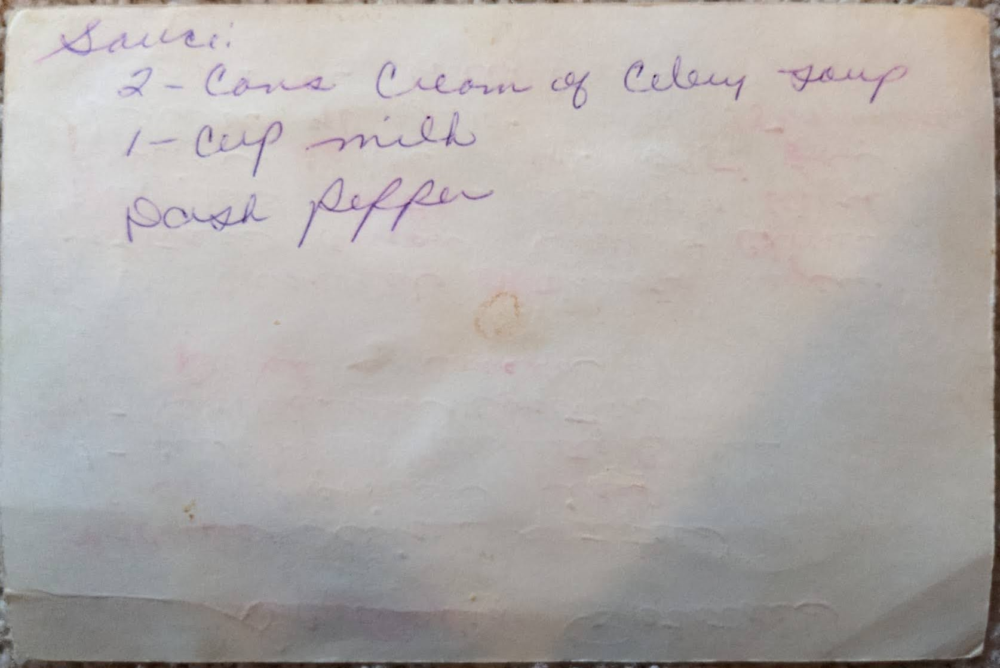

# {{ $frontmatter.title }}

### ingredients:

- <MixologyConversion n="4 cups"/> sliced potatoes
- <MixologyConversion n="2"/> small onion diced
- <MixologyConversion n="1 cup"/> diced velveeta cheese
- <MixologyConversion n="1 tbsp"/> butter
- dash paprika [?]

sauce
- <MixologyConversion n="1 cans"/> cream of celery soup
- <MixologyConversion n="1 cup"/> milk
- dash pepper

### instructions:

- 2 qt. casserole alternate layers of potatoes, onion, sauce and cheese
- dot [?] with butter, sprinkle with paprika
- cover [?] bake 375º for 1 hour
- uncover bake 15 minutes longer or until done

---

**citation**:
[Aunt Euniav](../README.md)

