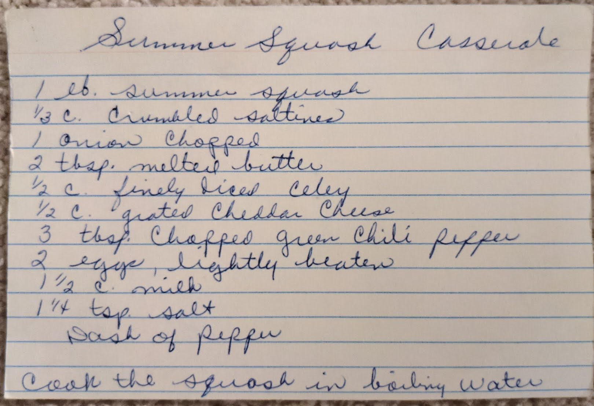
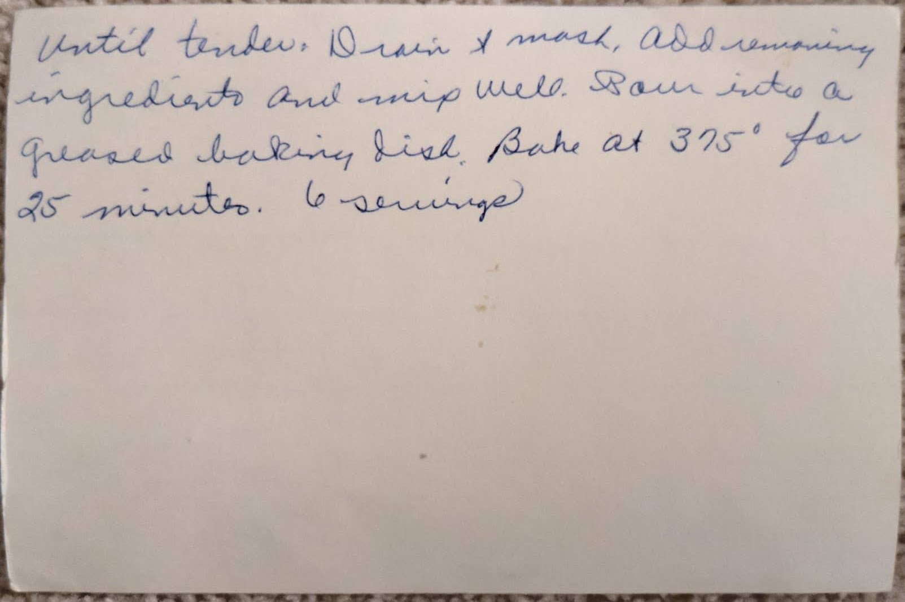

# {{ $frontmatter.title }}

### ingredients:

- <MixologyConversion n="1 lbs"/> summer squash
- <MixologyConversion n="0.33 cup"/> crumbled saltines
- <MixologyConversion n="1"/> onion chopped
- <MixologyConversion n="2 tbsp"/> melted butter
- <MixologyConversion n="0.5 cup"/> finely diced celery
- <MixologyConversion n="0.5 cup"/> grated cheddar cheese
- <MixologyConversion n="3 tbsp"/> chopped green chili pepper
- <MixologyConversion n="2"/> eggs lightly beaten
- <MixologyConversion n="1.5 cup"/> milk
- <MixologyConversion n="1.25 tsp"/> salt
- dash of pepper

### instructions:

- cook the squash in boiling water until tender
- drain and mash
- add remaining ingredients and mix well
- pour into a greased baking dish
- bake at 375º for 25 minutes
- 6 servings

---

**citation**:
[Aunt Euniav](../README.md)

