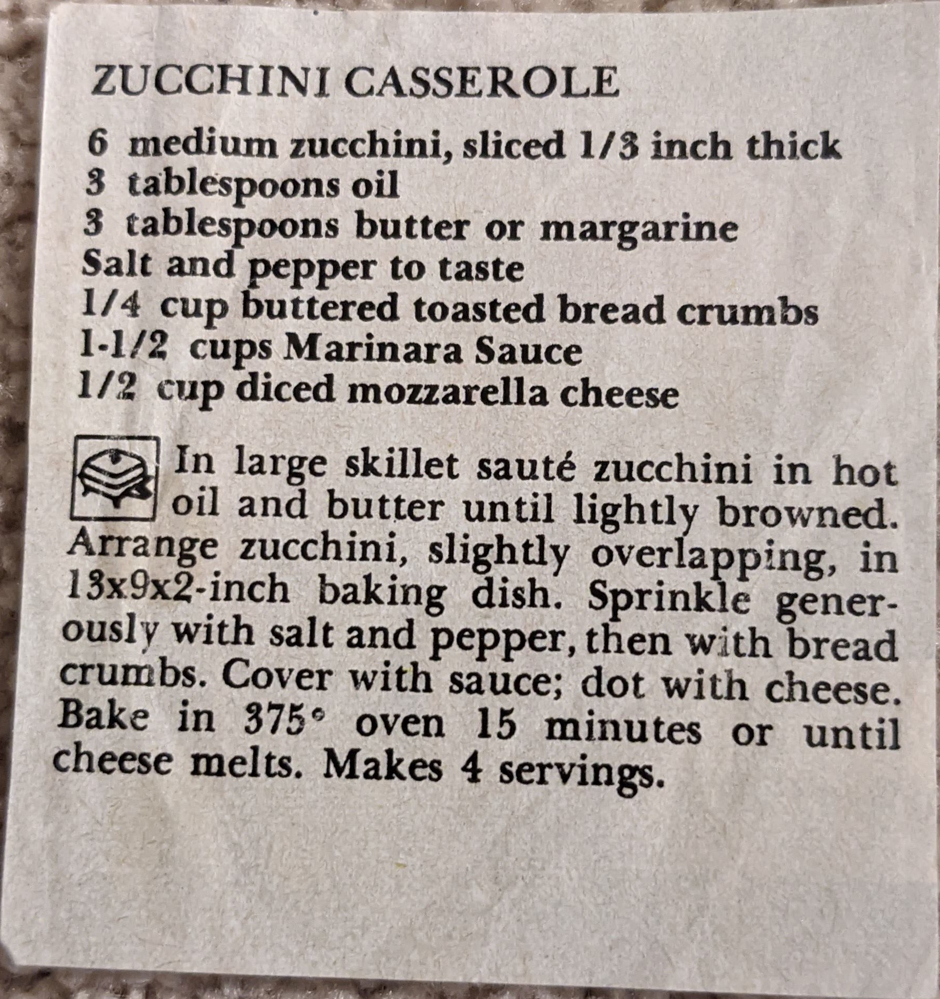

# {{ $frontmatter.title }}

### ingredients:

- <MixologyConversion n="6"/> medium zucchini, sliced $\frac{1}{3}$ inch thick
- <MixologyConversion n="3 tbsp"/> oil
- <MixologyConversion n="3 tbsp"/> butter or margarine
- salt and pepper to taste
- <MixologyConversion n="0.25 cup"/> buttered toasted bread crumbs
- <MixologyConversion n="1.5 cups"/> marinara sauce
- <MixologyConversion n="0.5 cup"/> diced mozzarella cheese

### instructions:

- in large skillet saute zucchini in hot oil and butter until lightly browned
- arrange zucchini, slightly overlapping, in ${13x9x2}$ inch baking dish
- sprinkle generously with salt and pepper, then with bread crumbs
- cover with sauce; dot with cheese crumbs
- cover with sauce; dot with cheese
- bake in 375º oven 15 minutes or until cheese melts
- makes 4 servings

---

**citation**:
Unknown magazine clipping

