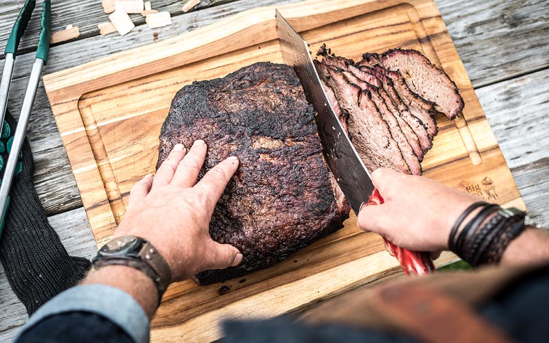

# {{ $frontmatter.title }}

Note: the approximate time for this recipe is 8 hours

### ingredients:

- <MixologyConversion n="10 lbs"/> brisket
- <MixologyConversion n="2 tbsp"/> paprika powder
- <MixologyConversion n="1 tbsp"/> ground fennel seed
- <MixologyConversion n="1.5 tbsp"/> garlic powder
- <MixologyConversion n="0.5 tbsp"/> ground cumin seed
- <MixologyConversion n="1.5 tbsp"/> dried thyme
- <MixologyConversion n="1.5 tbsp"/> dried oregano
- <MixologyConversion n="1.5 tbsp"/> dark brown sugar
- <MixologyConversion n="1.5 tbsp"/> black pepper
- <MixologyConversion n="1 tbsp"/> fine sea salt

### instructions:

- mix the ingredients for the rub
- rub the brisket with mixture and let rest for at least 1 hour at room temperature
- heat grill to 275ºF
- soak wood chips (hickory)
- once grill is lit and meat has rested, scatter chips in and place brisket on smoke
- set probe target tempature to 185ºF (takes about 8 hours)
- once target tempature reached, remove brisket and let rest in tin foil for 30 minutes

---

**citation**:
[Big Green Egg](https://www.biggreenegg.eu/en/inspiration/recipes/brisket)

