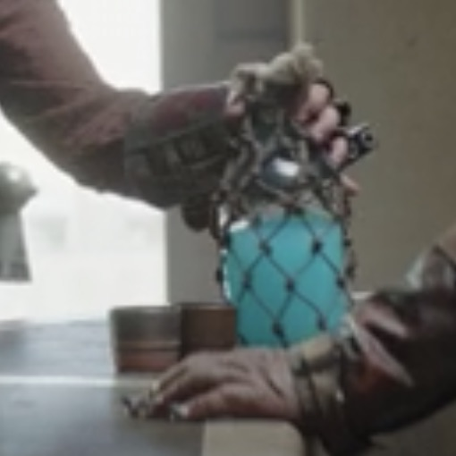

# {{ $frontmatter.title }}

### {{ $frontmatter.description }}

### ingredients:

- <MixologyConversion n="1.5 floz"/> gin or vodka
- <MixologyConversion n="0.5 floz"/> blue curacao
- <MixologyConversion n="0.33 floz"/> lime juice
- splash of simple syrup
- shake vigorously over ice, then strain into the glass
- top with club soda to taste (about 3 oz)

---

**citation**:
[Reddit - I tried making some "home-brewed" glowing spotchka!](https://www.reddit.com/r/StarWars/comments/ee2vpt/i_tried_making_some_homebrewed_glowing_spotchka/)
